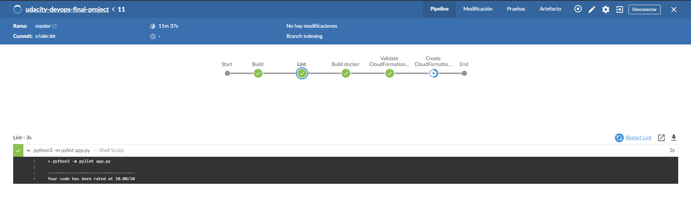
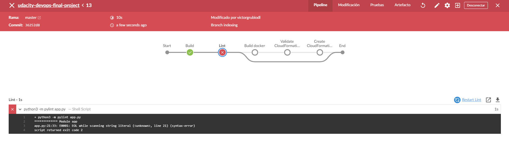
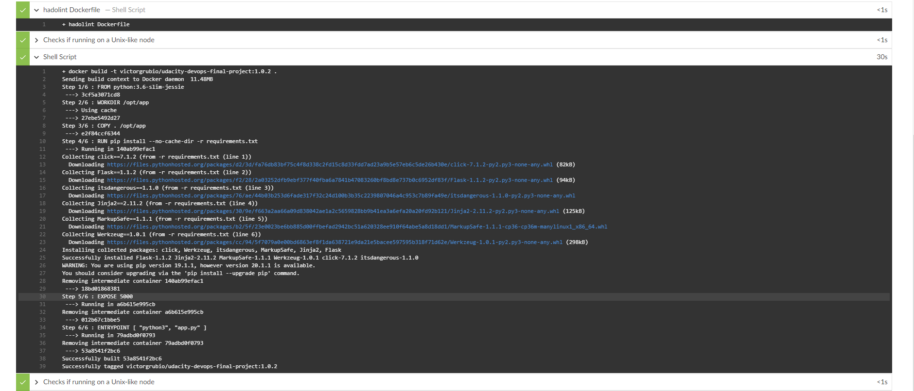
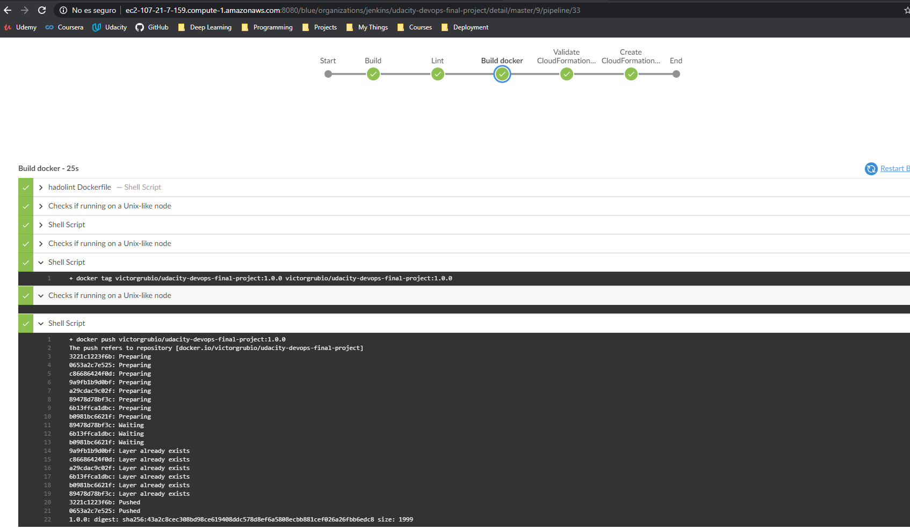
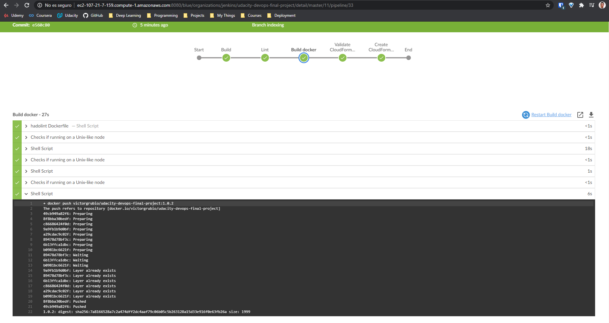
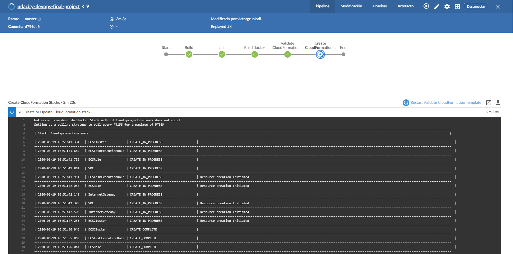
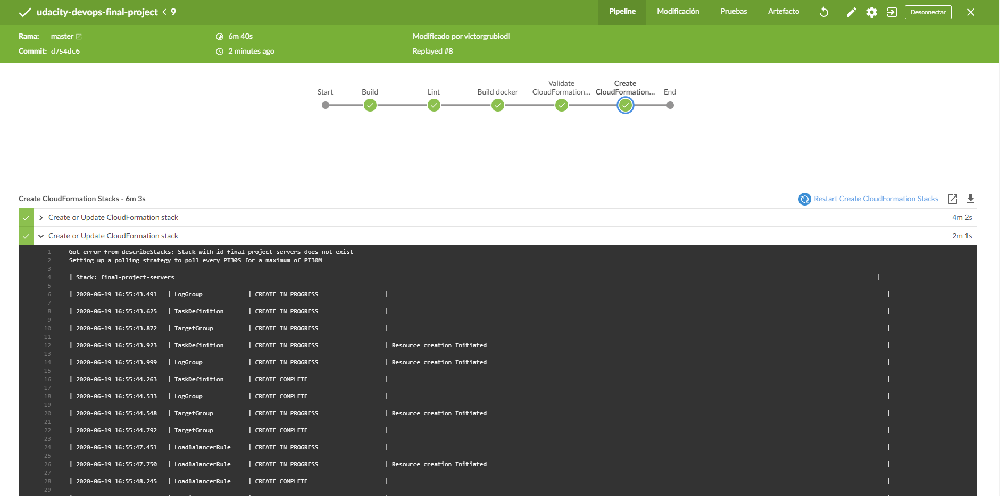
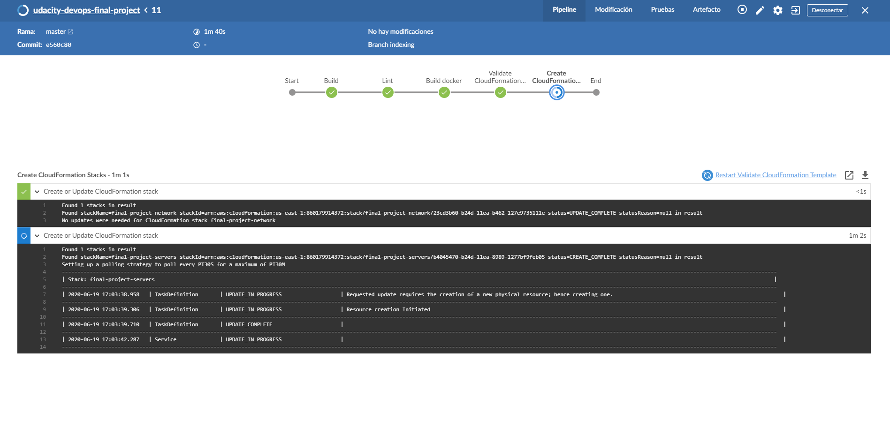
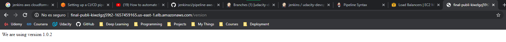

# Udacity Cloud Devops Final Project

This is the submission document for the final project of the Cloud Devops Nanodegree by Victor Garcia Rubio.

First of all, thanks to the Udacity team, specially the teachers and the reviewers for the excellent work. This is a great course and I have learnt a lot.

This project consisted on the CI/CD pipeline of a Flask app using Jenkins and CloudFormation.

## Review of submission

Link to [repo](https://github.com/victorgrubio/udacity-devops-final-project.git)

### Docker image

The project uses a Dockerfile, attached on the zip file of the submission and the repo with name Dockerfile. It contains a simple Flask application.

The image is available at dockerhub using this [link](https://hub.docker.com/repository/docker/victorgrubio/udacity-devops-final-project)

### Linting

In the first figure, we can observe the linting of the code (app.py), with a successful result. In the second image, we observed how the pipeline is stopped when an error is thrown.

### Docker pipeline

In the first image, we show the process of build the image during the Jenkins pipeline. In the Jenkinsfile available at the repo, you can observe how the process is done. 

Secondly, we have a picture describing how the image (1.0.0) is pushed to the repo to be available for the deployment.

Finally, we have an image that describes how a new version (1.0.2) is updated.

### CloudFormation deployment

The code contains a folder with all the CloudFormation scripts, templates and parameters to deploy our system using this service. Moreover, we have implemented the Continuous Deployment using Jenkins. As you may observe, the jenkins file contains two stages to validate and deploy the stacks.

In the next images we show how the stack is on creation process, then created and finally updated

The deployment uses a rolling techniques as it subtitutes sequentially with the newer versions of the image the ECS Auto scaling stack.

Finally, here you have the result of the flask application working and showing the version of the code.

Thanks again for your help, this has been a great journey. Best regards!

Victor Garcia Rubio